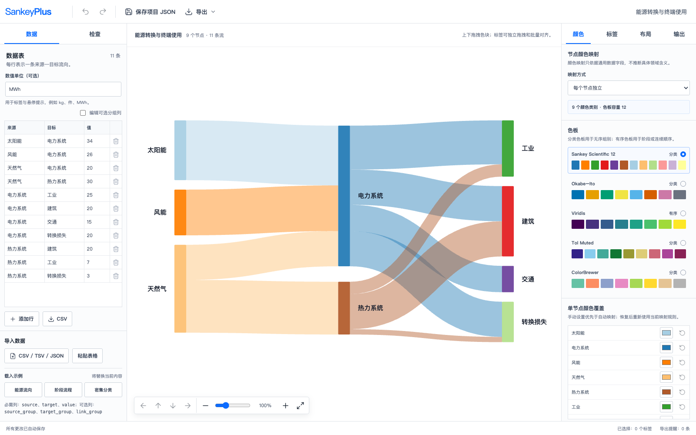

# SankeyPlus

SankeyPlus 是一款在浏览器中使用的通用交互式桑基图编辑器。导入“来源—目标—数值”数据后，可以直接拖动节点和标签、统一调整颜色与排版，并导出适合论文、报告和演示文稿使用的高质量图片。



## 为什么使用 SankeyPlus

- **直接编辑图形**：节点色块和标签都可以拖动，流带与引导线会实时跟随。
- **批量整理布局**：支持标签多选、整列移动、对齐和均匀分布，画布尺寸也可按需调整。
- **集中控制样式**：颜色、标签、布局和输出各自集中在独立面板，减少重复设置与冲突。
- **适合多种数据**：不绑定具体学科或业务类型，只要数据能够表达“从哪里流向哪里”即可使用。
- **面向高质量输出**：支持 SVG、PNG、TIFF、打印或 PDF，并可设置成品宽度、DPI 和透明背景。
- **本地保存数据**：数据和编辑状态保存在当前浏览器中，应用不会主动上传用户数据。

## 三步完成一张桑基图

1. 在“数据”面板导入 CSV、TSV、JSON，或直接粘贴表格。
2. 在画布上拖动节点和标签，并在“颜色”“标签”“布局”面板调整视觉效果。
3. 在“输出”面板设置图片尺寸，查看导出提醒，然后选择需要的文件格式。

SankeyPlus 内置了多个示例，可以先载入示例熟悉操作，再替换为自己的数据。

## 数据格式

最简单的数据只需要 `source`、`target` 和 `value` 三列：

```csv
source,target,value
来源 A,处理中,120
处理中,去向 1,80
处理中,去向 2,40
```

还可以增加以下可选列，用于控制颜色分组：

```csv
source,target,value,source_group,target_group,link_group
来源 A,处理中,120,入口,处理阶段,路径 A
处理中,去向 1,80,处理阶段,终点,路径 A
```

`value` 必须是大于 0 的数值。当前自动布局适用于无环的有向流图；如果数据中存在循环流，页面会给出明确提示。

## 图形编辑

- 节点色块可上下拖动，流带会随节点位置实时变化。
- 标签默认放在节点外侧；空间不足或标签被移开时，可按设定显示引导线。
- 支持修改标签内容、字体、字号、颜色、粗体和斜体。
- 支持标签多选、批量移动、对齐、分布、锁定和方向键微调。
- 节点宽度、节点间距、画布宽高和缩放比例均可调整。
- 支持撤销、重做和恢复自动布局。

## 颜色与可读性

- 提供适合分类数据和有序数据的多套色板。
- 节点可统一着色，也可按阶段、分组或单个节点设置颜色。
- 流带颜色和透明度可以独立调整，不会改变节点色块的透明度。
- 标签默认使用统一字体颜色，也可以由用户自行覆盖。
- 提供灰度、红色觉缺陷和绿色觉缺陷校样，帮助检查颜色是否容易区分。
- 当分类数量超过色板容量、颜色重复或文字对比度不足时，页面会给出提醒。

## 保存与导出

- “保存项目 JSON”用于保存当前数据和编辑状态，之后可以重新导入并继续修改。
- 支持导出 SVG、PNG、TIFF、CSV，以及通过浏览器打印为 PDF。
- PNG 和 TIFF 会写入设定的物理 DPI；SVG 会保留毫米尺寸和可编辑文字。
- 导出提醒会检查标签重叠、越界、文字对比度和数据问题，但不会阻止用户导出。
- 可同时导出发表清单 JSON，记录图片尺寸、数据设置和检查结果，便于归档。

如需 EPS，建议先导出 SVG，再使用 Inkscape、Illustrator 或期刊指定流程转换，并在最终尺寸下检查字体。

## 数据与隐私

SankeyPlus 是纯浏览器端工具，没有用户账户或后端数据库。导入的数据、编辑状态和自动保存内容仅保存在当前浏览器本地，应用不会主动将它们上传到服务器。

清除该网站的浏览器存储会同时清除自动保存内容。重要图表请使用“保存项目 JSON”另行备份。

## 本地运行

需要 Node.js `^20.19.0` 或 `>=22.12.0`。

```bash
npm ci
npm run dev
```

启动后，按照终端显示的本地地址在浏览器中打开 SankeyPlus。

## 参与贡献

欢迎提交问题和改进建议。准备贡献代码时，请先阅读 [CONTRIBUTING.md](CONTRIBUTING.md)；安全问题请按照 [SECURITY.md](SECURITY.md) 私下报告。

## 开源许可证

SankeyPlus 使用 [MIT License](LICENSE)。
